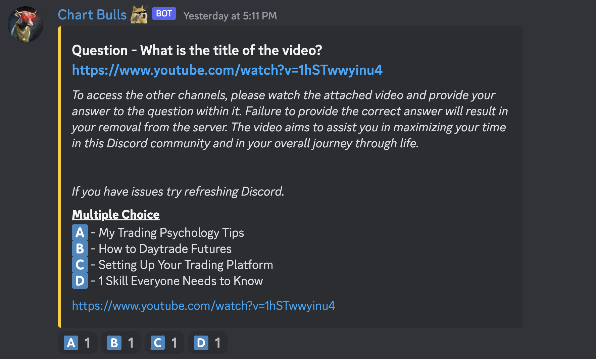
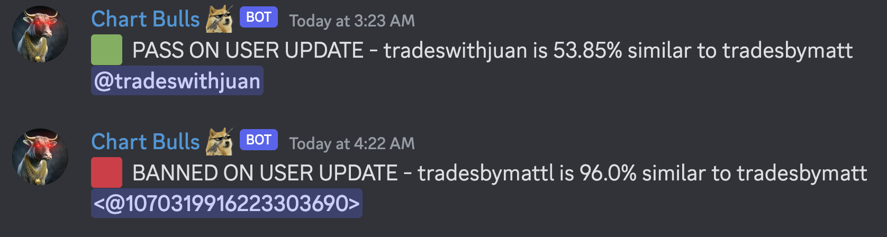
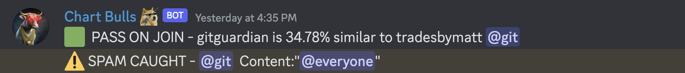

## Discord Anti-spam Bot 🤖

### Requirements

- Linux VPS Server - [My VPS Provider](https://www.linode.com/lp/refer/?r=3eabea16dddc74fdc11ae5d0a73cd919c1ed1ae0)
- Discord Server
- Discord Bot

## 📜 [Installation Guide](/.setup/setup.md)

#### About

Scammers join open popular discord servers and solicit fake products to server members. They DM users of the server pretending to be an influencer and offer fake products/services scamming innocent people. Banning/Moderating of these users would require monitoring 24/7 so this bot was created.

##### Features

- Unique Verification System

  - 
  - Gives users a verified role if they can answer a unique question correctly
  - Via the /verify command, you can set to the question to whatever you would like
  - Will require you to make channels only visible to members who have the verified role

- Remove Imposters

  - 
  - Bans when username is very similar to a moderator
  - Kicks when username is similar to a moderator
  - Checks for an imposter when
    - Member joins
    - Member updates profile

- Spam Message Filter
  - 
  - Removes and kicks a user who posts a scam/spam message

      
    <h3> Enjoy and 🖕🏼 you scammers.</h3>

  

  <a href='mailto:theprogrammergary@gmail.com' target='_blank'>
    Contact for hire
    
  </a>

  <a href='https://ko-fi.com/M4M6RTXS2' target='_blank'>
    Support this project
    
  </a>

